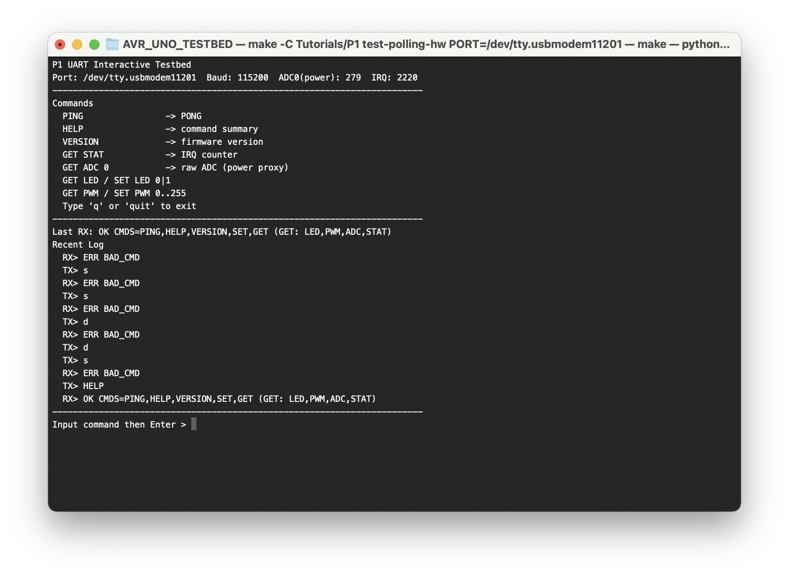

# P1 - UART 명령 프로토콜 + PC 자동 테스트 러너

## 목표
`deepresearch.pdf`의 P1 요구사항에 맞춰 다음을 구현합니다.
- 링버퍼 기반 UART 수신
- 텍스트 명령 파서와 에러 코드
- JSON 테스트 케이스 기반 자동 테스트 러너




## 현재 구현 범위
- Firmware:
  - `PING`, `HELP`, `VERSION`
  - `SET/GET LED`
  - `SET/GET PWM`
  - `GET ADC <ch>`
  - 에러 코드: `BAD_CMD`, `BAD_ARG`, `BAD_TARGET`, `BAD_RANGE`, `LINE_TOO_LONG`, `RX_OVERFLOW`
- PC Runner:
  - `tests/cases/smoke.json` 입력
  - `--mock` 모드(하드웨어 없이 검증)
  - `--port` 모드(실보드 시리얼 검증)

## 디렉터리
- `firmware/`: AVR 펌웨어
- `tests/`: 테스트 러너 + 케이스
- `docs/`: 프로토콜/테스트 문서

## 공통 레이어 (계승 기반)
P1은 `Tutorials/common/firmware`의 공통 모듈을 사용합니다.
- `uart_ring.c/.h`: UART RX ISR 링버퍼 + TX helper
- `cmd_line.c/.h`: 라인 단위 명령 파싱

P2/P3는 같은 모듈을 재사용하므로, UART/CLI 동작 규칙이 프로젝트 간 일관되게 유지됩니다.

## UART 동작 원리 (현재 구조 기준)
### 1) 초기화 단계
- `uart_init()`에서 UART를 115200 baud, 8N1로 설정합니다.
- `UCSR0B`에서 `RXEN0`, `TXEN0`, `RXCIE0`를 활성화합니다.
- `main()`에서 `sei()`를 호출해 전역 인터럽트를 켭니다.

### 2) 수신 인터럽트와 링버퍼
- UART로 1바이트가 들어오면 `ISR(USART_RX_vect)`가 호출됩니다.
- ISR 내부에서 `UDR0`를 읽고 `rx_buf` 링버퍼에 저장합니다.
- 버퍼가 가득 찬 경우에는 `rx_overflow = true`를 세팅하고 해당 바이트는 드롭합니다.
- 정상 저장된 경우에만 `uart_rx_isr_count`가 증가합니다.

### 3) 메인 루프의 파싱/응답
- 메인 루프는 `uart_getc_nonblock()`으로 링버퍼를 폴링합니다.
- `\\n` 또는 `\\r`를 만나면 한 줄 명령으로 판단해 `handle_command()`로 전달합니다.
- `handle_command()`는 토큰 단위로 명령을 파싱하고, 결과를 UART로 응답합니다.
- 예: `PING` 전송 시 보드는 `PONG` 반환

### 4) UART RX ISR 카운터 의미
- `GET STAT` 명령은 `uart_rx_isr_count`를 읽어 `OK UART_RX_ISR=<count>` 형태로 보여줍니다.
- 값은 “타이머”가 아니라 “UART RX 인터럽트가 정상 처리된 바이트 수”에 가깝습니다.
- 따라서 PC에서 자동으로 명령을 계속 보내면 사용자 입력이 없어도 증가할 수 있습니다.

### 5) 테스트 스크립트와의 관계
- `tests/runner.py`: 케이스 파일 기반으로 명령을 순차 전송하고 응답 prefix를 검증합니다.
- `tests/polling_testbed.py`: 인터랙티브 콘솔이며 기본은 자동 폴링 OFF입니다.
- 인터랙티브 모드에서 사용자가 입력하지 않으면 UART TX가 없으므로 카운터도 증가하지 않습니다.
- `--auto-poll-status`를 켜면 스크립트가 주기적으로 `GET ADC 0`, `GET STAT`를 보내므로 카운터가 증가합니다.

### 6) 오류/예외 처리 포인트
- `LINE_TOO_LONG`: 한 줄 명령이 내부 버퍼 길이를 넘은 경우
- `BAD_ARG`, `BAD_TARGET`, `BAD_RANGE`, `BAD_CMD`: 파싱/검증 실패
- `RX_OVERFLOW`: 수신 인터럽트가 버퍼에 저장하지 못한 경우

## 사용 방법
1. 빌드
```bash
make -C Tutorials/P1 build
```

2. mock 테스트
```bash
make -C Tutorials/P1 test
```

3. 보드 업로드
```bash
make -C Tutorials/P1 flash PORT=/dev/tty.usbmodemXXXX
```

4. 하드웨어 테스트
```bash
make -C Tutorials/P1 test-hw PORT=/dev/tty.usbmodemXXXX
```

5. 인터랙티브 UART 테스트베드
```bash
make -C Tutorials/P1 test-polling-hw PORT=/dev/tty.usbmodemXXXX
```

설명:
- 상단에 명령 리스트와 라이브 상태(ADC0/UART_RX_ISR)를 계속 표시
- 커맨드를 직접 입력하면 즉시 UART로 전송되고 응답이 로그에 표시
- `PING` 전송 시 `PONG` 응답 확인 가능
- 기본값은 자동 상태 폴링 OFF (사용자 입력이 없으면 UART TX 없음)
- 상태 수동 갱신: `r` 입력
- 자동 폴링이 필요하면:
```bash
python3 Tutorials/P1/tests/polling_testbed.py --port /dev/tty.usbmodemXXXX --auto-poll-status
```
- `q` 또는 `quit`로 종료

## AVR Libraries
> [avr/io.h](https://github.com/vancegroup-mirrors/avr-libc/blob/master/avr-libc/include/avr/io.h)

> [avr/sfr_defs.h](https://github.com/vancegroup-mirrors/avr-libc/blob/master/avr-libc/include/avr/sfr_defs.h)

> [avr/iom328p.h](https://github.com/vancegroup-mirrors/avr-libc/blob/master/avr-libc/include/avr/iom328p.h)
